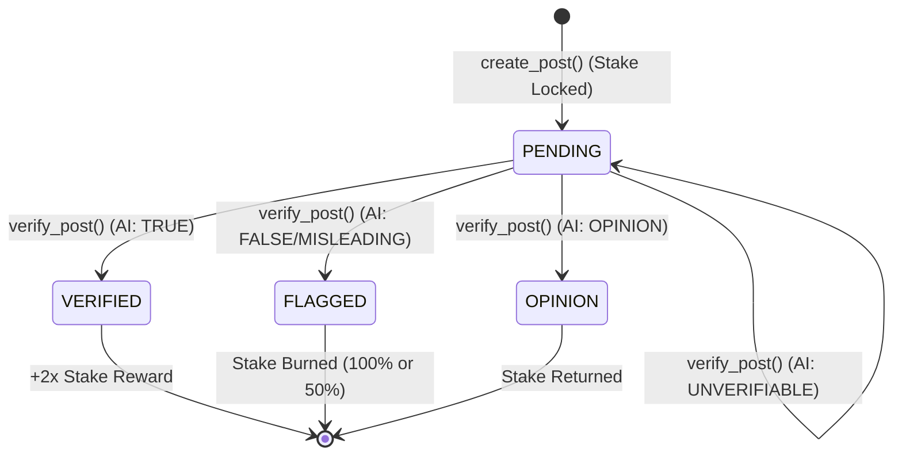

# Architecture Deep Dive

## High-Level Flow

```mermaid
sequenceDiagram
    participant User
    participant Frontend
    participant GenLayer Network
    participant AI Validators
    participant Web (Reuters, AP)

    User->>Frontend: Creates Post (Stakes 1 TRUTH)
    Frontend->>GenLayer Network: Call create_post()
    GenLayer Network-->>Frontend: Status: PENDING
    
    User->>Frontend: Clicks "Verify Now"
    Frontend->>GenLayer Network: Call verify_post()
    
    rect rgb(20, 30, 50)
        Note over GenLayer Network, Web (Reuters, AP): AI Jury Consensus Phase
        GenLayer Network->>Web (Reuters, AP): gl.nondet.web.render()
        Web (Reuters, AP)-->>GenLayer Network: Raw Text Content
        GenLayer Network->>AI Validators: gl.nondet.exec_prompt()
        AI Validators-->>GenLayer Network: JSON Verdict
    end
    
    GenLayer Network->>GenLayer Network: Validate & Apply Tokenomics
    GenLayer Network-->>Frontend: Verdict + Slashing/Reward Event
    Frontend-->>User: UI Update (Badge + Reasoning)
```

## Smart Contract State Machine

Posts in TruthLens follow a strict state machine dictated by the GenLayer contract:



## Why Traditional Web3 Cannot Do This

| Requirement | Ethereum / Solana | TruthLens (GenLayer) |
|---|---|---|
| **Web Crawling** | Requires centralized Oracle (Chainlink), slow and expensive | **Native**. `web.render()` |
| **Fact-Checking** | Requires human multi-sig or voting (takes days) | **Native**. LLMs at the consensus layer |
| **Subjective Logic** | Impossible. Smart contracts are strictly deterministic. | **Core Feature**. `exec_prompt()` |

TruthLens demonstrates the true power of Intelligent Contracts: creating economic incentives around subjective human concepts like truth and opinion.
