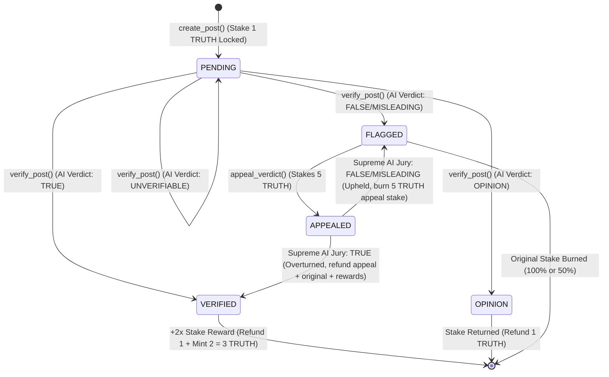

# Architecture Deep Dive

## High-Level Flow

```mermaid
sequenceDiagram
    participant User
    participant Frontend
    participant GenLayer Network
    participant AI Validators
    participant Web (Reuters, AP, Wiki, BBC)

    User->>Frontend: Connects Wallet / Claims Faucet (<= 5 TRUTH)
    Frontend->>GenLayer Network: Call claim_starter_tokens()
    GenLayer Network-->>Frontend: Balance: +100 TRUTH
    
    User->>Frontend: Creates Post (Stakes 1 TRUTH)
    Frontend->>GenLayer Network: Call create_post()
    GenLayer Network-->>Frontend: Status: PENDING
    
    User->>Frontend: Clicks "Verify Now"
    Frontend->>GenLayer Network: Call verify_post()
    
    rect rgb(20, 30, 50)
        Note over GenLayer Network, Web (Reuters, AP, Wiki, BBC): AI Jury Consensus Phase (prompt_comparative)
        GenLayer Network->>Web (Reuters, AP, Wiki, BBC): gl.nondet.web.render()
        Web (Reuters, AP, Wiki, BBC)-->>GenLayer Network: Raw Text Content
        GenLayer Network->>AI Validators: gl.nondet.exec_prompt()
        AI Validators-->>GenLayer Network: JSON Verdict
    end
    
    GenLayer Network->>GenLayer Network: Semantic Equivalence Check
    GenLayer Network-->>Frontend: Verdict + Slashing/Reward Event
    Frontend-->>User: UI Update (Badge + Reasoning)

    opt Disagree with Verdict (FLAGGED)
        User->>Frontend: Click "Appeal Verdict" (Stakes 5 TRUTH)
        Frontend->>GenLayer Network: Call appeal_verdict()
        rect rgb(40, 20, 50)
            Note over GenLayer Network, Web (Reuters, AP, Wiki, BBC): Supreme AI Jury Forensic Phase
            GenLayer Network->>Web (Reuters, AP, Wiki, BBC): gl.nondet.web.render() (All 4 Sources)
            GenLayer Network->>AI Validators: Deep Forensic LLM Prompt
        end
        GenLayer Network->>GenLayer Network: Uphold or Overturn Verdict
        GenLayer Network-->>Frontend: Appeal Resolved + Stake Settlement
        Frontend-->>User: UI Update (Status & Appeal Reasoning)
    end
```

## Smart Contract State Machine

Posts in TruthLens follow a strict state machine dictated by the GenLayer contract:



## Why Traditional Web3 Cannot Do This

| Requirement | Ethereum / Solana | TruthLens (GenLayer) |
|---|---|---|
| **Web Crawling** | Requires centralized Oracle (Chainlink), slow and expensive | **Native**. `web.render()` |
| **Fact-Checking** | Requires human multi-sig or voting (takes days) | **Native**. LLMs at the consensus layer |
| **Subjective Logic** | Impossible. Smart contracts are strictly deterministic. | **Core Feature**. `exec_prompt()` |
| **Comparative Consensus** | Hardcoded strict equality fails due to minor text diffs | **Semantic**. `prompt_comparative` checks equivalence |

TruthLens demonstrates the true power of Intelligent Contracts: creating economic incentives around subjective human concepts like truth and opinion.
